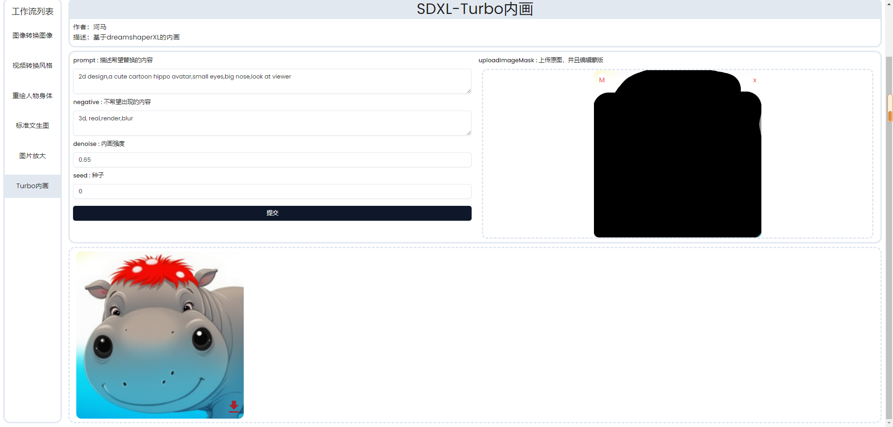

本项目的功能是使用 comfyUI 导出的 api 文件，让用户来自定义可以暴露的参数，建立一个更简洁的 comfyUI 操作界面--或者说`门面`,使得普通使用者可以简单的使用 comfyui 而不被复杂界面和参数给弄得晕头转向。

## 安装与运行

安装：

```bash
npm install
```

运行：

```bash
npm run dev
```

## 设置环境变量

将`.env.example`文件复制一份，命名为`.env.local`，并将`NEXT_PUBLIC_SERVER_ADDRESS`的值替换为实际的 ComfyUI 服务器地址。

## 使用

用浏览器打开 [http://localhost:3000](http://localhost:3000) 可访问基于设置生成的简化版的 ComfyUI 操作界面.



用浏览器打开 [http://localhost:3000/workflow](http://localhost:3000/workflow) 可访问编辑和设置工作流的界面.


## 编辑门面及设置

1. 编辑门面
   在门面编辑器里，你可以将想编辑的 comfyui workflow 粘贴到左侧的编辑框中。在右侧，你可以设置简化后门面的名称、功能介绍，缩写，以及暴露给用户的参数。参数的设置包括参数名、参数类型、参数描述、参数默认值等。

2. 保存设置文件
   等到都设置完毕，点击保存按钮，你可以得到一个 json 文件，将这个文件重命名为`<slug>_settings.json`，然后放到`public/workflows`文件夹下。

3. 应用设置文件
   在`public/workflows`文件夹下，有一个`comfyUIWorkFlows.json`文件，这个文件是用来启动所有的设置文件的。请将你上一步得到的信息添加到这个文件里，就可以到简易使用界面上使用你刚刚编辑好的门面了。

### 举例

你拿到了一个 comfyui workflow (api 格式的)，在门面编辑器里编辑好以后，将它保存为`my_workflow_settings.json`，然后放到`public/workflows`文件夹下。接着，打开`comfyUIWorkFlows.json`文件，添加如下内容：

```json
{
  "slug": "my_workflow",
  "name": "我的工作流"
}
```

接下来就可以在简易使用界面上使用你刚刚编辑好的`我的工作流`了。
